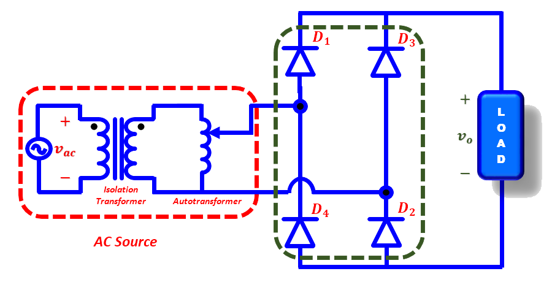
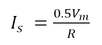
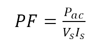

### Theory

  
  
Fig. 1. Circuit diagram of diode bridge rectifier.

 
Diode bridge rectifier circuit operates in two modes: (a) Positive half cycle of input ac voltage and (b) Negative half cycle of input ac voltage. Brief description of these modes is given below.
  

<table border="0" align="center" style="width:100%; border:none;">
  <tr>
<td style="width:50%">

  
Fig. 2(a). Positive-half cycle.
  

</td>
<td style="width:50%">
  

  
Fig. 2(b). Negative-half cycle.
  

 
    </td>
  </tr>
</table>
 
 
 During the positive half-cycle of the AC input voltage, diodes ‘D1’ and ‘D2’ are conducting and the power is supplied to the load while in the negative half-cycle diodes ‘D3’ and ‘D4’ are conducting. The steady-state waveforms of the output voltage (Vo), input current (Iin) and diode voltage (VD1) are shown in Fig. 3. The output voltage is pulsating DC superimposed with ac ripple.

 
  
The average value of the output load voltage is:

  

  

    ..(1)

 

  
&nbsp;

  

    ..(2)

     
 

 
  
The average value of the output load current is:

  

  
      

    ..(3)

 

 
  
The average power supplied to load is:

  

  
      

    ..(4)
   
      

 

 
  
The RMS value of the output voltage, Vrms

  

  
      

    ..(5)
      

  
 

 
  
The rms output current (Irms)is

  

  
      

    ..(6)
      

  

 
The ac component of output voltage is:
  

  
      

    ..(7)
      

 

 
  
The output effective (rms) ac power is;

  

  
      

    ..(8)
      

 

 
  
The ripple factor, which is a measure of the ripple content, is defined as;

  

  
      

    ..(9)
      

 

 
  
Efficiency (or rectification ratio) of a rectifier is:

  

  
      

 
    ..(10)
      
    
 

 
  
The transformer utilization factor is defined as:

  

  
      

    ..(11)
      

 

 
  
&nbsp;

  

<table border="0" align="center" style="width:100%; border:none;">
<tr>
<td style="width:50%">

  
(a) Waveforms without filter.
  

</td>
<td style="width:50%">

  
(b) Waveforms with C-filter.
  

 
    </td>
</tr>
</table>

 

Fig. 3. Steady-state waveforms of diode bridge rectifier.
 

 

 
  
RMS voltage of the transformer secondary is

  

  
      

    ..(12)
      

 

 
  
Transformer secondary current is

  

  
      

    ..(13)
      

 

 
  
The power factor for resistive load can be defined as;

  

  
      

    ..(14)
      

  

  

  
  
Fig. 4. Circuit diagram of diode bridge rectifier with C-filter.

    

 

 
  
The diode bridge rectifier converts the ac input voltage into a pulsating dc output voltage as shown in Fig. 3(a). Here, the peak value is higher than average dc output voltage. Also, the peak-to-peak ripple voltage is more. To get constant dc voltage with minimum ripple content, a low-pass filter (here a capacitor filter) is inserted between the rectifier bridge output and load. By connecting the “C-filter” the load voltage waveform becomes smooth and thus the peak-to-peak ripple voltage reduces, which is shown in Fig. 3(b). The peak–to-peak output ripple voltage is:

  

  
      

    ..(15)
      

 

 
  
The ripple factor of output voltage is:

  

  
      

    ..(16)
      

 

&nbsp;

 

  
      

    ..(17)
      

 

 

The average output voltage with C-filter is:

  

  
      

    ..(18)
      

  
